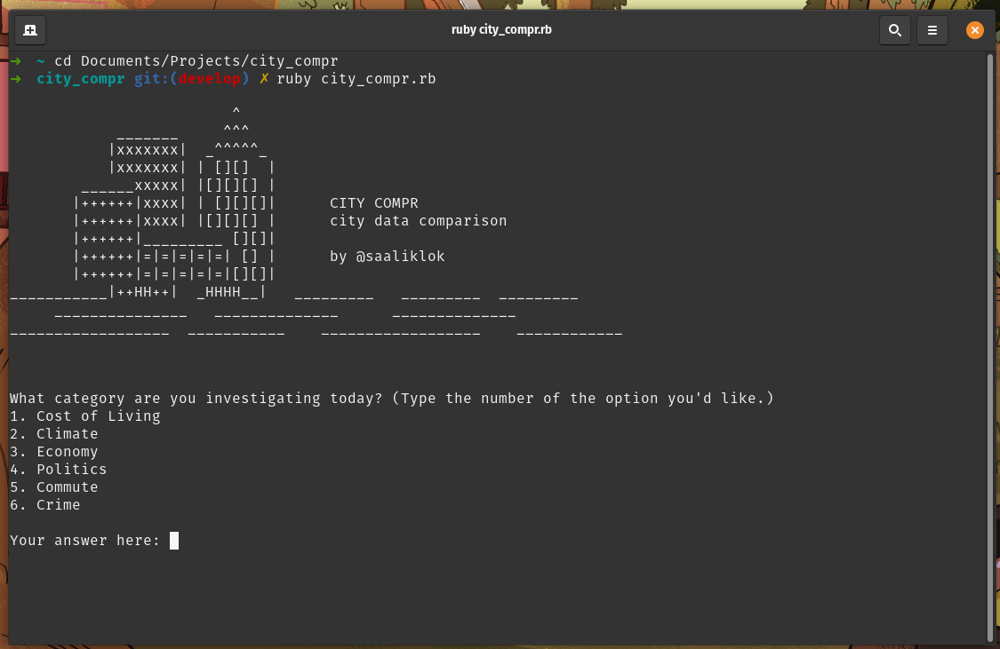
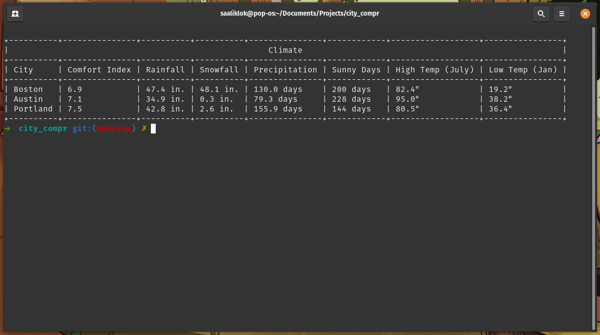

# City Compr

Compare metrics of US cities across multiple different categories, all from your terminal.

- Climate
- Cost of Living
- Economy
- Politics
- Commute
- Crime

### Usage

1. Ensure you have Ruby Installed `ruby --version` 
2. Clone this repository
3. `cd` into the `city_compr` folder.
3. Run: `ruby city_compr.rb` in your terminal

### Motivation

As a fledgling Rubyist, I was looking for a project to use pure Ruby, without diving into Rails, Sinatra, or any other framework.
Simultaneously, I've been researching lots of cities, mostly just for fun.
When I came across an awesome website with tons of data on cities and what it's like to live in them, I decided to scrape the information that I found most relevant and present it on the terminal in the form of a table.

I had lots of fun building this in a couple days, and particularly enjoyed using the following tools to spice up the command line UX, and make HTML parsing more manageable:
- [Terminal Table](https://github.com/tj/terminal-table)
- [Nokogiri](https://github.com/sparklemotion/nokogiri)

_Built with <3 with Ruby in Boston_
